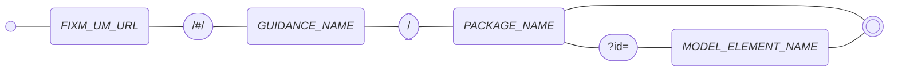

# Embedding references to the FIXM User Manual

The FIXM User Manual provide encoding guidance for each of the FIXM Core properties. Implementers of information services or systems that use FIXM Core 
may want to integrate references to relevant pieces of encoding guidance from this manual into their own service/system documentation, 
for instance as part of the description of their information service payloads.

This page explains how the URLs for the encoding guidance are formed, in order to facilitate this kind of integration.

## URL structure

The URL for the encoding guidance is always structured as follows:

`[UM_URL]` + `/#/` + `[GUIDANCE_NAME]` + `/` + `[PACKAGE_NAME]` + `?id=` + `[PROPERTY_NAME]`

where

- *`[FIXM_UM_URL]`* shall take one of the following values 
  - `https://docs.fixm.aero/#/`
  - `https://docs-4-3-0.fixm.aero/#/`

- *`[GUIDANCE_NAME]`* shall take the value `general-guidance`

- *`[PACKAGE_NAME]`* shall be the valid name of an official FIXM Core package, prefixed with the prefix of the namespace in which that package exists. The prefix and the package name shall be separated by `_`.
  - Examples:
    - `fx_Aircraft` for FIXM Core package `Aircraft` that exists in namespace `xmlns:fx="http://www.fixm.aero/flight/4.3"`
    - `fb_Address` for FIXM Core package `Address` that exists in namespace `xmlns:fb="http://www.fixm.aero/base/4.3"`  

- *`[MODEL_ELEMENT_NAME]`*, if provided, shall be
  - for an `fx_` package, the valid name (as defined in UML) of a FIXM Core property defined in that package, in lower case
    - Example: `aircraftidentification` for FIXM Core property `aircraftIdentification` defined in class `FlightIdentification` inside package `Aircraft`
    - IMPORTANT NOTE: the name of the container class/type does not appear in the URL.
  - for an `fb_` package, the valid name (as defined in UML) of a FIXM Core class defined in that package, in lower case
    - Example: `onlinecontact` for FIXM Core class/type `OnlineContact` defined inside package `Address`

## Examples

https://docs.fixm.aero/#/general-guidance/fx_FlightData?id=aircraftidentification
https://docs.fixm.aero/#/general-guidance/fb_Address?id=onlinecontact

https://docs-4-2-0.fixm.aero/#/

## Exceptions

