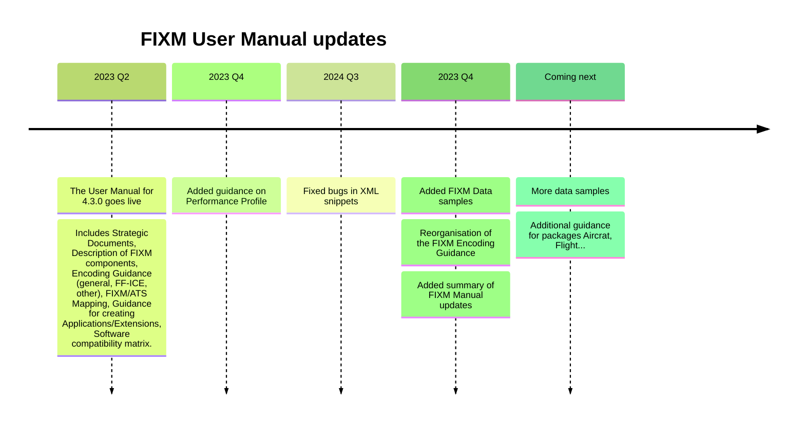

# Flight Guidance

>===============================
>
>Copyright © 2024, Members of the FIXM CCB
>
>===============================
>
>Redistribution and use in source and binary forms, with or without modification, are permitted provided that the following conditions are met:
>
>    Redistributions of source code must retain the above copyright notice, this list of conditions and the disclaimer.
>    Redistributions in binary form must reproduce the above copyright notice, this list of conditions and the disclaimer in the documentation and/or other materials provided with the distribution.
>    Neither the names of the FIXM CCB members nor the names of their contributors may be used to endorse or promote products derived from this specification without specific prior written permission.
>
>DISCLAIMER
>
>THIS SPECIFICATION IS PROVIDED BY THE COPYRIGHT HOLDERS AND CONTRIBUTORS "AS IS" AND ANY EXPRESS OR IMPLIED WARRANTIES, INCLUDING, BUT NOT LIMITED TO, THE IMPLIED WARRANTIES OF MERCHANTABILITY AND FITNESS FOR A PARTICULAR PURPOSE ARE DISCLAIMED. IN NO EVENT SHALL THE COPYRIGHT OWNER OR CONTRIBUTORS BE LIABLE FOR ANY DIRECT, INDIRECT, INCIDENTAL, SPECIAL, EXEMPLARY, OR CONSEQUENTIAL DAMAGES (INCLUDING, BUT NOT LIMITED TO, PROCUREMENT OF SUBSTITUTE GOODS OR SERVICES; LOSS OF USE, DATA, OR PROFITS; OR BUSINESS INTERRUPTION) HOWEVER CAUSED AND ON ANY THEORY OF LIABILITY, WHETHER IN CONTRACT, STRICT LIABILITY, OR TORT (INCLUDING NEGLIGENCE OR OTHERWISE) ARISING IN ANY WAY OUT OF THE USE OF THIS SOFTWARE, EVEN IF ADVISED OF THE POSSIBILITY OF SUCH DAMAGE.
>
>===============================
>
>Editorial note: this license is an instance of the BSD license template as provided by the Open Source Initiative: http://www.opensource.org/licenses/bsd-license.php
>
>The authoritative reference for FIXM is www.FIXM.aero.
