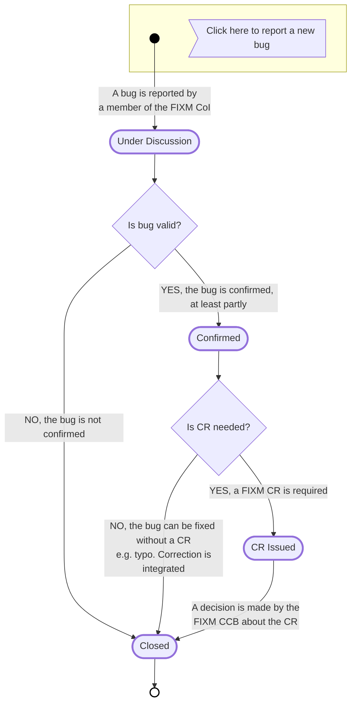

# Flight Guidance

```mermaid
graph TB
INITIAL_STATE(( ))
END_STATE(( ))
UNDER_DISCUSSION([Under Discussion])
CONFIRMED([Confirmed])
CR_ISSUED([CR Issued])
CLOSED([Closed])
is_bug_valid{Is bug valid?}
is_CR_required{Is CR needed?}

INITIAL_STATE --> |A bug is reported by <br>a member of the FIXM CoI| UNDER_DISCUSSION
UNDER_DISCUSSION --> is_bug_valid
is_bug_valid --> |NO, the bug is not confirmed| CLOSED
is_bug_valid --> |YES, the bug is confirmed, at least partly| CONFIRMED
CONFIRMED --> is_CR_required
is_CR_required --> |YES, a FIXM CR is required| CR_ISSUED
is_CR_required --> |NO, the bug can be fixed without a CR<br> e.g. typo. Correction is integrated| CLOSED
CR_ISSUED --> |A decision is made by the <br>FIXM CCB about the CR| CLOSED
CLOSED --> END_STATE

style INITIAL_STATE fill:black,stroke:black,stroke-width:2px
style END_STATE fill:white,stroke:black,stroke-width:2px
style UNDER_DISCUSSION stroke-width:3px
style CONFIRMED stroke-width:3px
style CR_ISSUED stroke-width:3px
style CLOSED stroke-width:3px

subgraph click_here_to_report_a_bug [ ]
INITIAL_STATE
CLICK_HERE>Click here to report a new bug]
end click_here_to_report_a_bug

click CLICK_HERE "https://teams.microsoft.com/l/entity/2a527703-1f6f-4559-a332-d8a7d288cd88/_djb2_msteams_prefix_3974824283?context=%7B%22subEntityId%22%3Anull%2C%22channelId%22%3A%2219%3A1922dacb8fd24c2cb21a0a188d3e8f43%40thread.tacv2%22%7D&groupId=75ac9b42-6d91-445a-98b7-df959b285110&tenantId=76f33c20-5979-4408-adf7-8b3c4be95e52&allowXTenantAccess=false" "Click to report a new bug"
```
