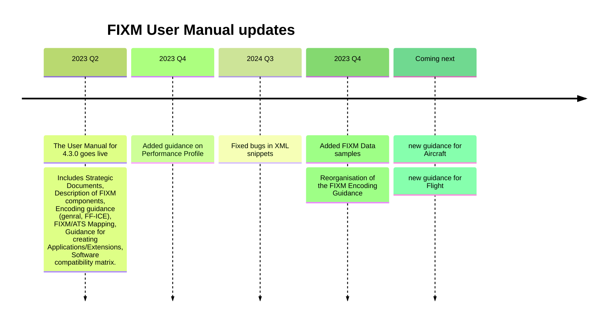

# Flight Guidance

```mermaid
%%{init: { 'logLevel': 'debug', 'theme': 'forest' } }%%
timeline
  title FIXM User Manual updates 
    2023 Q2 : The User Manual for 4.3.0 goes live : Includes Strategic Documents, Description of FIXM components, Encoding guidance (genral, FF-ICE), FIXM/ATS Mapping, Guidance for creating Applications/Extensions, Software compatibility matrix.
    2023 Q4 : Added guidance on Performance Profile
    2024 Q3 : Fixed bugs in XML snippets
    2023 Q4 : Added FIXM Data samples : Reorganisation of the FIXM Encoding Guidance
    Coming next : new guidance for Aircraft : new guidance for Flight
```
